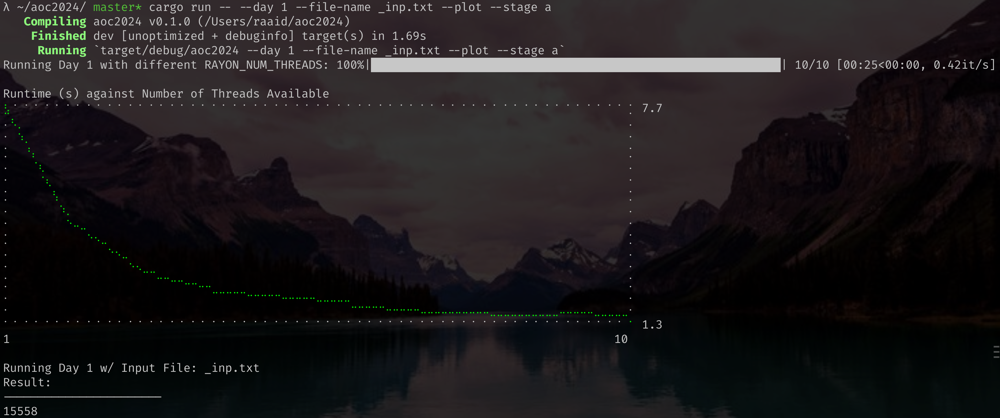

# Advent of Code 2024

This year for [Advent of Code](https://adventofcode.com/) I will be focusing on writing solutions that are _as parallel as possible_. 

For undertaking the task of writing parallel code, I have chosen to use Rust as my programming language, both because I want to learn Rust properly this year, and because it supposedly has fearless concurrency and safety for supporting parallel programming. 

The Rust crate that I will be using for writing parallel code is [Rayon](https://docs.rs/rayon/latest/rayon/). 

## Running Solutions 

If you want to run my solution for Day 1 part A with the input being stored in the file `_inp.txt`, then run the following command
```[zsh]
cargo run -- --day 1 --file-name _inp.txt --plot --stage a
```

## Adding solutions

If you want to use this template for your own Advent of Code setup, then first simply clone this repository.

If you want to add a solution for day 2, then add a file `day02.rs` inside `src/day`. If you want to add a solution for day 16, then add a file `day16.rs` inside `src/day`. 

Inside that file, add a method with the following signature.
```[rust]
use super::super::stage::{Stage, StageUnimplemented};
pub use std::error::Error;

pub fn run(_s: &str, stage: Stage) -> Result<String, Box<dyn Error>> {
  match stage {
    stage::Stage::A => Err(Box::new(StageUnimplemented(Stage::A))),
    stage::Stage::B => Err(Box::new(StageUnimplemented(Stage::B))),
  }
}
```

Replace the `Err(.)` values with implementations for each of the day's stages. 

Then, when you're done simply run the solutions with the command given above. 

## Visualizing Parallelism

If you have written a parallel solution using Rayon and you want to see how parallel your solution is exactly, then you can run 
```[zsh]
cargo run -- --day 1 --file-name _inp.txt --plot --stage a
```
Which will produce a plot of runtime in seconds against the number of threads that were made available to the `run` function that you implemented for the first stage of Day 1. 



